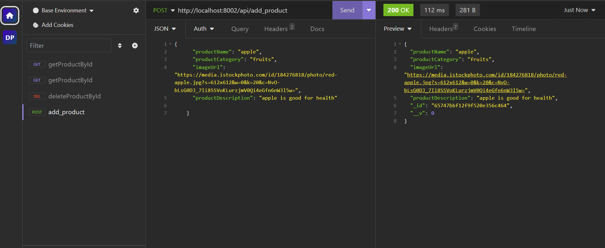
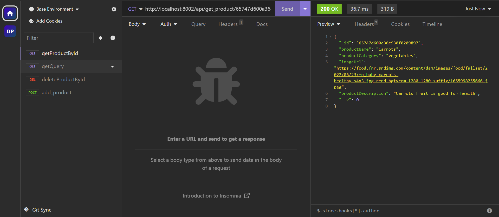
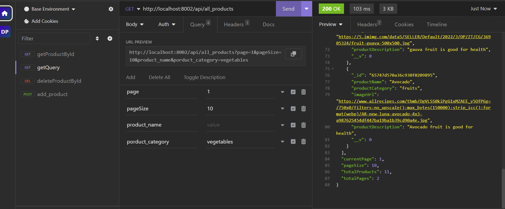
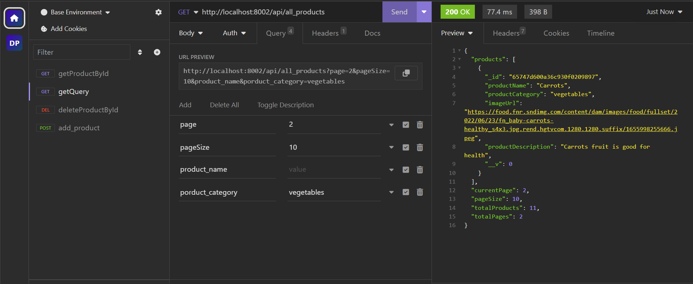
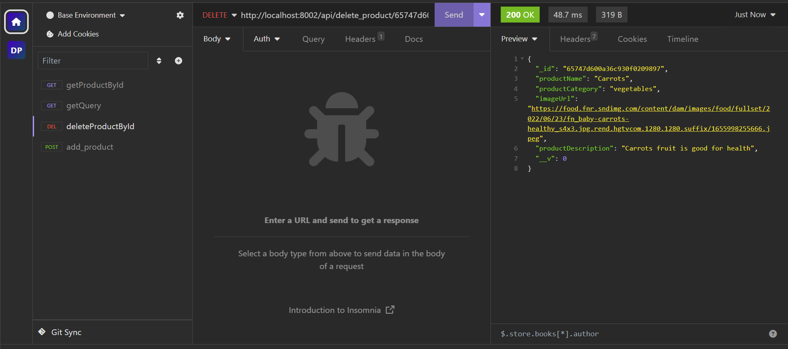

## product

## description

1. Create an api to create a product
   Product should have following fields:
   id, product name, product category, image url , product description

2. Create an api to fetch a product by product id (eg: /products/ASD455)

3. Create an api to fetch all products with filters and pagination
   (eg: /products?page=1&pageSize=10&productName=apple&category=electronics)

4. Create an api to delete a product by id

## packages used

1.nodejs
2.expressjs
3.mongoose
4.husky & prettier

husky and prettier are used as a best practice to keep clean code

## Evidences

**Create product**

**Get product by id**

**Get Query page1**

**Get Query page2**

**Delete product**

